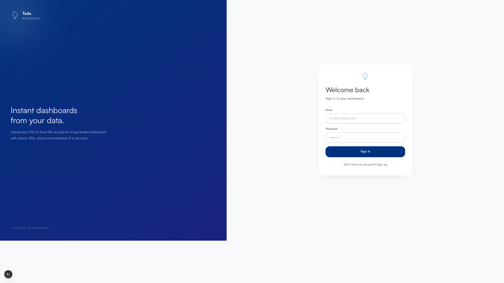
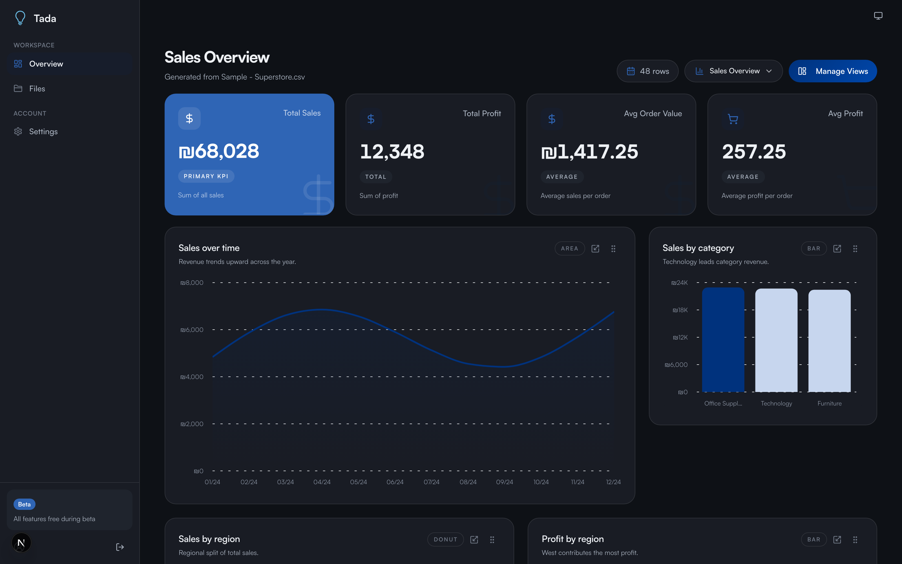
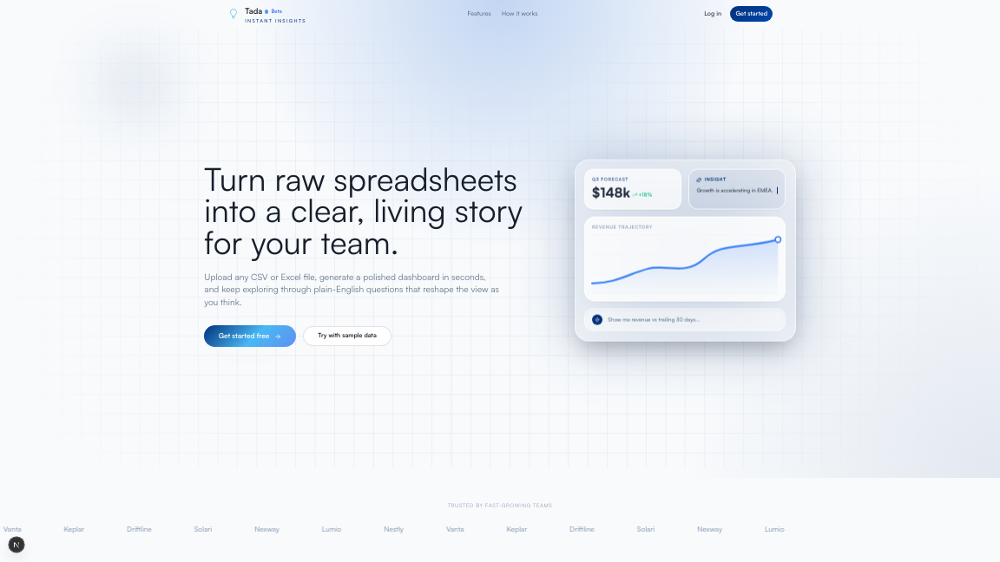
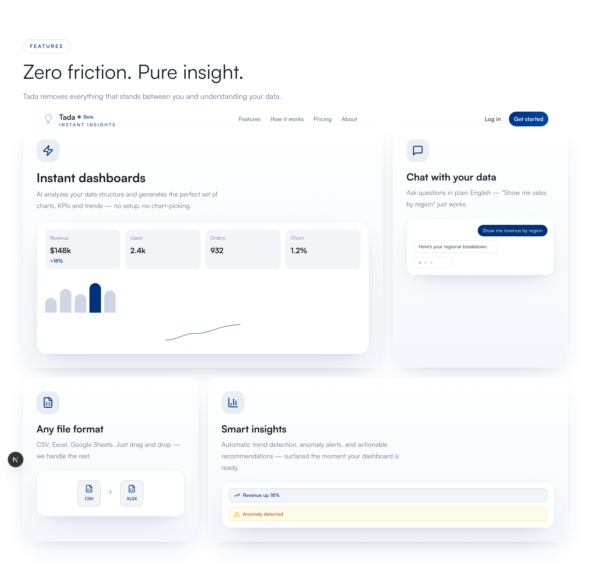
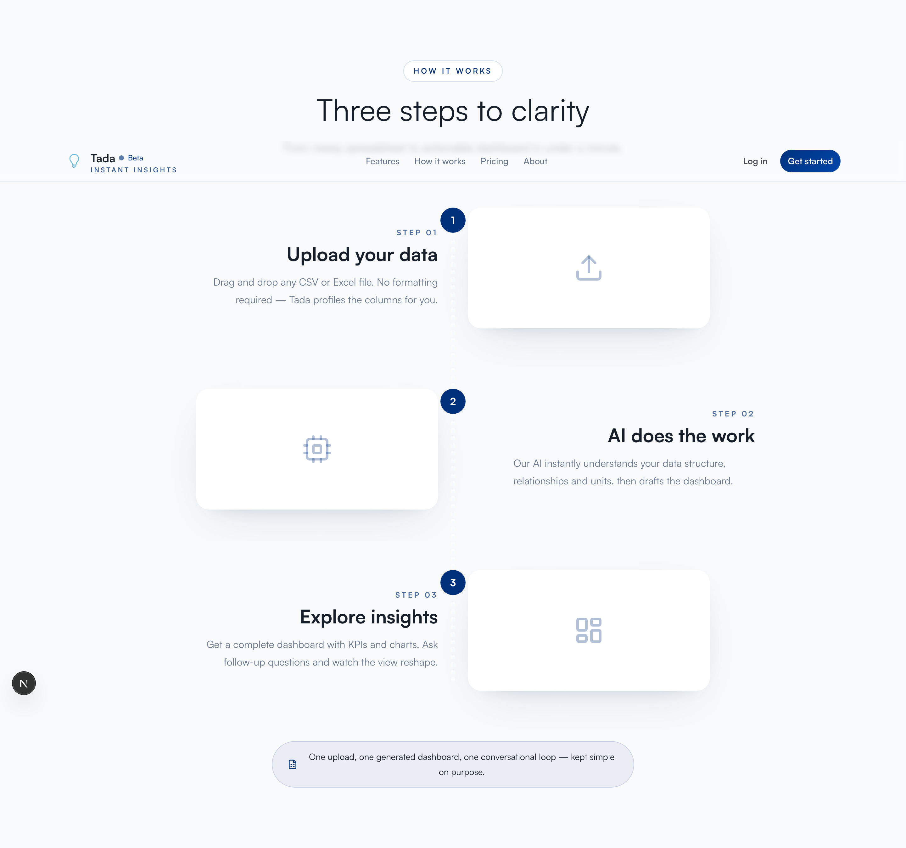

<a id="readme-top"></a>

<h1 align="center">
  
  <br />
  <b>Tada</b>
</h1>

<p align="center">
  Upload a spreadsheet, get a production-quality analytics dashboard with AI-powered charts, KPIs, and a conversational copilot - in seconds.
</p>

<p align="center">
  <a href="https://nextjs.org"></a>
  <a href="https://www.typescriptlang.org"></a>
  <a href="https://supabase.com"></a>
  <a href="https://groq.com"></a>
  <a href="https://tailwindcss.com"></a>
  <a href="https://github.com/Hezi777/Tada/blob/main/LICENSE"></a>
</p>

<details>
  <summary>Table of Contents</summary>
  <ol>
    <li><a href="#about">About</a></li>
    <li><a href="#features">Features</a></li>
    <li><a href="#screenshots">Screenshots</a></li>
    <li><a href="#tech-stack">Tech Stack</a></li>
    <li><a href="#getting-started">Getting Started</a></li>
    <li><a href="#contributing">Contributing</a></li>
    <li><a href="#license">License</a></li>
  </ol>
</details>

---

## About

Tada turns CSV, Excel, and PDF files into interactive dashboards without any manual configuration. Upload a file and the pipeline profiles your data (pure TS — types, nulls, stats, PII detection), suggests what kind of data it is, and generates a dashboard whose charts are **grounded in a retrieval index of BI best-practice rules** — not just whatever the LLM feels like drawing. A floating copilot chat answers questions in Hebrew or English, grounded in a per-dataset vector index of your actual data. Dashboards persist per-user in Supabase behind Row-Level Security.

<p align="right">(<a href="#readme-top">back to top</a>)</p>

## Features

| Area                       | Description                                                                                                                                                                                                              |
| -------------------------- | ------------------------------------------------------------------------------------------------------------------------------------------------------------------------------------------------------------------------ |
| File ingestion             | CSV, Excel (`.xlsx`/`.xls`), and PDF uploads parsed server-side with validation (size/type/row caps) and Israeli DD/MM date normalization                                                                                |
| Automatic profiling        | Pure-TS profiling: column types, null counts, stats, top values — plus PII detection (emails, Israeli phones/IDs) that keeps personal data out of AI prompts and embeddings                                              |
| Topic detection            | The profile is embedded and classified against topic descriptors (cash flow, sales, grades, …); the user confirms topic + chart count before generation                                                                  |
| Grounded generation        | Chart configs are generated with rules retrieved from the BI Rules RAG, then enforced by a deterministic rule engine (donut→bar conversion, top-N + Other bucketing, horizontal bars for long labels, aggregation fixes) |
| Grounded chat              | Hebrew/English Q&A, trend explanations, and add/remove/edit-chart commands, grounded in retrieval over the per-dataset vector index with caching                                                                         |
| KPI cards                  | Primary metric highlighted in accent color; money-like columns formatted as ₪ with bidi-safe rendering                                                                                                                   |
| Chart canvas               | Apple-widget grid with drag-and-drop reordering, discrete size classes (S/M/L/XL — a different view is rendered per class, not a resized chart), and a Manage Views sheet to pin/show/hide/delete charts                  |
| Multi-dashboard workspaces | Named dashboards with custom icons and colors; instant switch via cached state                                                                                                                                           |
| Authentication             | Supabase email/password + Google OAuth, with server-side session validation on all API routes                                                                                                                            |
| Persistence & security     | Datasets, charts, KPIs, and both vector indexes in Supabase Postgres with checked-in idempotent migrations and per-command RLS policies                                                                                  |
| Web app                    | Landing, pricing, about, privacy, and terms pages plus settings (profile picture, account deletion)                                                                                                                      |

<p align="right">(<a href="#readme-top">back to top</a>)</p>

## Architecture: the two RAG systems

Tada's core idea is that both chart generation and chat answers are _grounded_, using two separate pgvector indexes. Embeddings are computed locally with Transformers.js (`Xenova/multilingual-e5-small`, 384-dim) because Groq offers no embeddings endpoint and Hebrew data needs a multilingual model — no extra API key required.

**1. BI Rules RAG (`bi_rules_chunks`)** — queried at dashboard-generation time.
A versioned dataset of ~60 data-visualization rules (`data/bi-rules.json`, sourced from Cleveland/McGill, the FT Visual Vocabulary, Datawrapper, NN/g, WCAG, and Israeli data conventions) is embedded and seeded into Postgres. When a dashboard is generated, the dataset profile is turned into a retrieval query, the most relevant rules go into the LLM prompt, and a deterministic engine (`src/features/dashboard/server/rules.ts`) then _enforces_ the machine-checkable rules on the output — applying each rule's `action_if_fail` by severity.

**2. Per-user Data RAG (`user_data_chunks`)** — queried at chat time.
After generation, the dataset is distilled into compact text chunks (overview, per-column stats, category aggregates, monthly time buckets, redacted sample rows), embedded, and stored scoped to the owning user (RLS-enforced). Each chat question retrieves the most relevant chunks instead of re-reading the file, with per-question caching and content-hash checks so unchanged data is never re-embedded.

<p align="right">(<a href="#readme-top">back to top</a>)</p>

## Screenshots

### Dashboard



### Dashboard - Dark Mode



### Landing Page - Hero



### Landing Page - Features Section



### Landing Page - How it Works



### Authentication - Sign In


<p align="right">(<a href="#readme-top">back to top</a>)</p>

## Tech Stack

| Layer                     | Technology                                                          |
| ------------------------- | ------------------------------------------------------------------- |
| Framework                 | Next.js 16 (App Router)                                             |
| Language                  | TypeScript (strict)                                                 |
| Styling                   | Tailwind CSS v3 + shadcn/ui                                         |
| Animation                 | Framer Motion                                                       |
| Charts                    | Recharts                                                            |
| Drag and drop             | @dnd-kit/core + @dnd-kit/sortable                                   |
| State management          | Lightweight custom store (`useSyncExternalStore`)                   |
| Schema validation         | Zod                                                                 |
| Auth + Database + Vectors | Supabase (Auth, Postgres, pgvector, Row-Level Security, Storage)    |
| LLM inference             | Groq — `llama-3.3-70b-versatile` (generation, classification, chat) |
| Embeddings                | Transformers.js — `Xenova/multilingual-e5-small`, computed locally  |
| Parsing                   | papaparse (CSV), SheetJS (Excel), unpdf (PDF)                       |
| Testing                   | Vitest + Testing Library                                            |

<p align="right">(<a href="#readme-top">back to top</a>)</p>

## Getting Started

**Prerequisites:** Node.js 20.9+ (CI runs on 22), a Supabase project, a Groq API key

```bash
git clone https://github.com/Hezi777/Tada.git
cd Tada
npm install
cp .env.example .env.local
```

Fill in `.env.local`:

```env
NEXT_PUBLIC_SUPABASE_URL=https://<your-project>.supabase.co
NEXT_PUBLIC_SUPABASE_ANON_KEY=<anon-key>
GROQ_API_KEY=<groq-api-key>
# Optional — only needed for account deletion + the seed script:
SUPABASE_SERVICE_ROLE_KEY=<service-role-key>
# Optional model overrides (default: llama-3.3-70b-versatile):
# GROQ_DASHBOARD_MODEL=
# GROQ_CHAT_MODEL=
```

**1. Apply migrations** — run the SQL files in `supabase/migrations/` in order against your project (Supabase SQL editor, or `npx supabase db push` if you use the CLI). They are idempotent: safe to re-run.

**2. Seed the BI rules index** (embeds `data/bi-rules.json` into pgvector; downloads the local embedding model ~30MB on first run):

```bash
npm run seed:bi-rules
```

**3. Run:**

```bash
npm run dev
```

Open [http://localhost:3000](http://localhost:3000). Useful scripts: `npm run typecheck`, `npm run lint`, `npm run test`.

**Google OAuth (optional):** create an OAuth client in Google Cloud Console and add its credentials under _Authentication → Providers → Google_ in the Supabase dashboard, with `https://<your-project>.supabase.co/auth/v1/callback` as the redirect URI. Email/password works without it.

> **Notes:** Without `GROQ_API_KEY` the app still works — charts come from the deterministic heuristic engine and chat degrades gracefully. The first upload after a server start is a little slower while the local embedding model loads.

<p align="right">(<a href="#readme-top">back to top</a>)</p>

## Contributing

1. Fork the repository on GitHub.
2. Create a feature branch: `git checkout -b feature/your-feature-name`.
3. Make your changes, ensuring `npm run lint` and `npm run typecheck` pass.
4. Commit with a descriptive message.
5. Push your branch and open a pull request against `main`.

<p align="right">(<a href="#readme-top">back to top</a>)</p>
